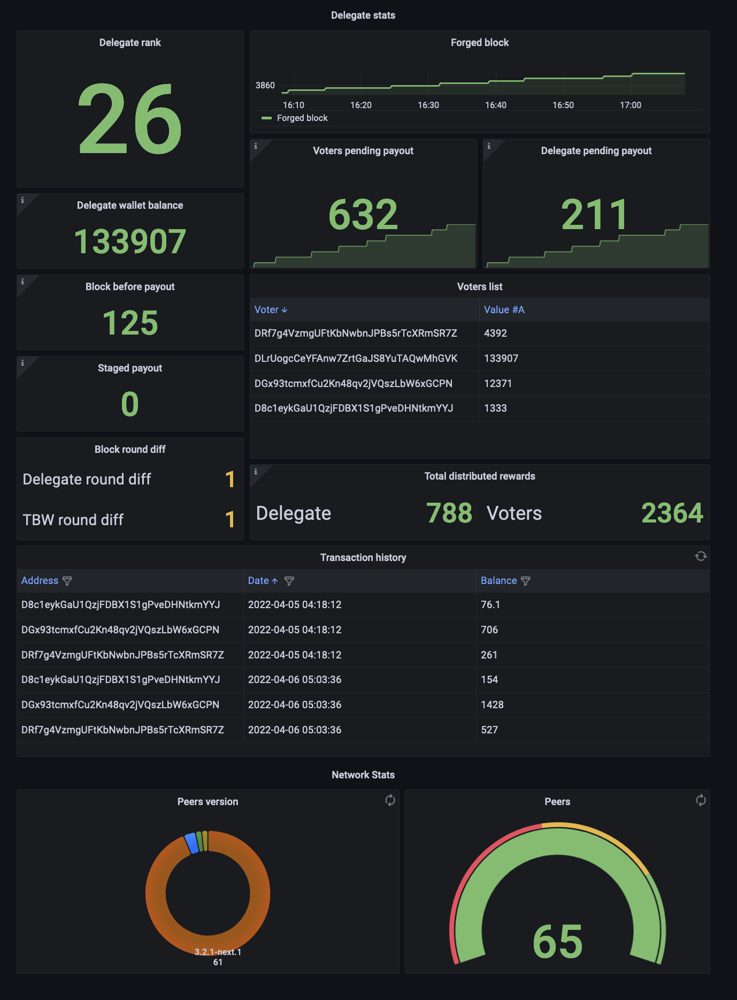

# TBW Node monitoring

This repository contains a monitoring tool aiming Delegates who want a packaged observability & alerting tool in order to monitor their forger node and also their payout script based on [Goose TBW payout script](https://github.com/galperins4/core2_tbw).

This tool has a dependency with [tbw_exporter_api](https://github.com/sevi93/tbw_exporter_api) in order to display all the TBW and Network metrics on the dashboard.


<p align="center">
	
</p>

# Architecture

The installer will deploy the following docker images :

__**Node Exporter**__
- Export of forger health & hw metrics
- Will export metrics of the need of a software upgrade

__**Cadvisor**__
- Tool to export the health of the docker images ( will be used in a new futur to create the health diagram of forger/tbw/docker architecture )

__**Prometheus**__
- Monitoring tool which poll multiple target metrics ( TBW exporter API / Node exporter / cadvisor )
- Set of alerts used to trigger alertmanager to send telegram alert

__**Alertmanager**__
- Tool to send alerts to telegram bot 

__**Grafana**__
- Observability tool to display all gathered metrics from prometheus

# Setup

```
./install.sh
```
Go to `http://node_ip:3100` to access grafana and change the password of the admin account which is by default admin/admin

# Telegram alerting

Alerting is currently in beta, if you want to use it, you will need to:
 - Create a telegram bot and get the bot_token / chat_id
 - Modify `tbw_node_monitoring/alertmanager/alertmanager.yml` & change the bot_token / chat_id value
 - Re-run the installer.sh
 - Docker restart

# Security

By default grafana will listen on all addresses and will be exposed to outside networks, so this is recommanded to change the default password imediately after the setup and also to use a firewall on top of your node